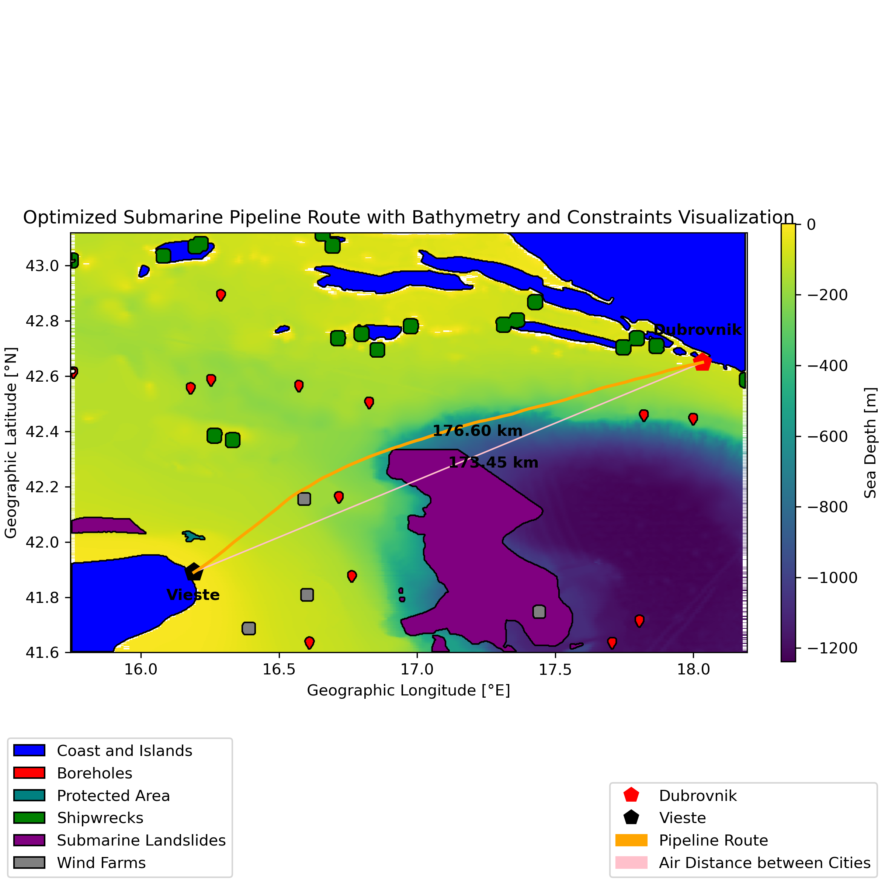
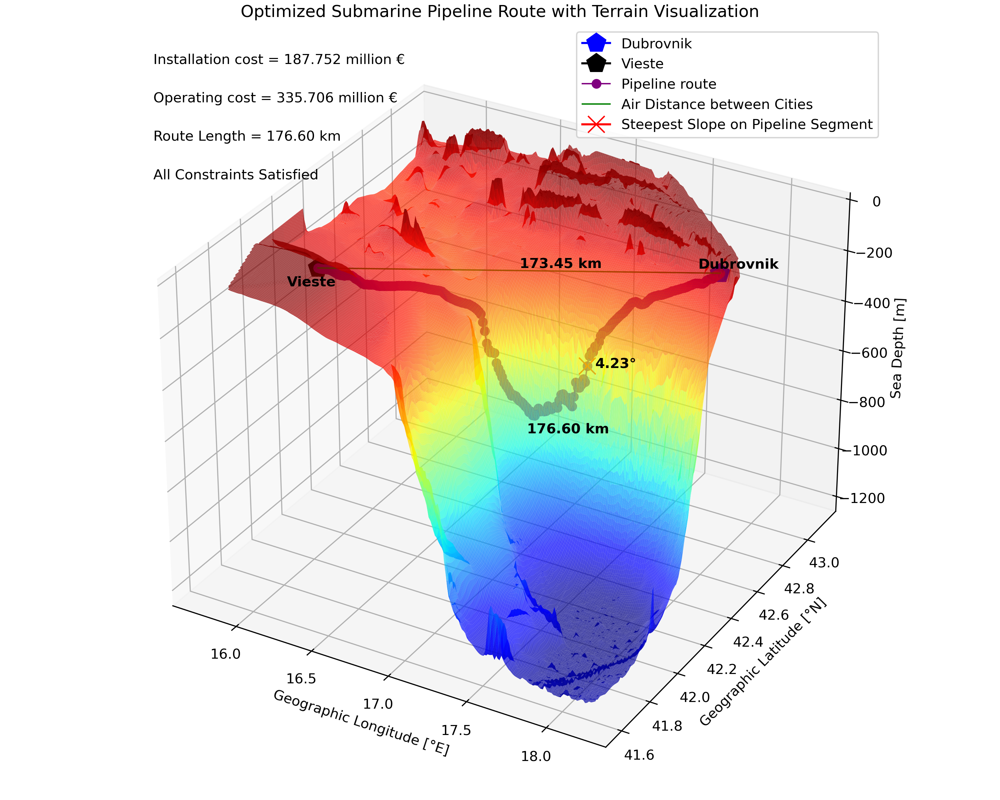

# Submarine Pipeline Optimization

**Optimization of Submarine Pipelines**

## Overview

Submarine Pipeline Optimization is a Python script designed to optimize the routing of submarine pipelines. This project leverages Particle Swarm Optimization (PSO) to select the most cost-effective route for installation and operation, while adhering to various constraints and optimizing multiple parameters.

## Input Data

- **Input_Data/region.csv:** Contains XYZ coordinates of bathymetry, essential for understanding the underwater topography.
- **Input_Data/constraints:** This directory contains shapefiles defining different constraints that must be satisfied during the route optimization.
- **Input_Data/sea_floor_type:** Contains shapefiles that describe various seabed types, crucial for selecting the most suitable conditions.

## Output
 
The results of the optimization process are saved in the **Output_Data** directory, including the optimized submarine pipeline route and its visualization.

## Optimization Goal

The primary goal of this project is to minimize the installation and operation costs of submarine pipelines by selecting optimal conditions. These conditions involve finding the route with the minimum length, suitable slope, and appropriate burial depth, while also considering the selection of the most suitable seabed types.

## Constraints

To ensure the safety of the pipeline and its minimal environmental impact, the optimization process must satisfy various constraints. These constraints include avoiding areas with potential negative impacts on the route or the environment, such as:

- Areas containing boreholes
- Submarine landslides
- Fishing activity zones
- Shipwreck sites
- Wind farms
- Protected areas

## Getting Started

To get started with the project, follow these steps:

1. **Clone the Repository:** `git clone https://github.com/NikolaBanic/Submarine-Pipeline-Optimization.git`

2. **Install Dependencies:** Install the necessary Python libraries and dependencies, which include geospatial libraries and indago library for PSO optimization.

3. **Run the Script:** Execute the `Submarine_Pipeline_Optimization.py` script, providing the input data as described above.

4. **View the Results:** Check the `Output_Data` directory for the optimized pipeline route and visualizations.

## Contributing 

We welcome contributions to enhance this project. If you have ideas for improvements or would like to contribute code, please feel free to submit pull requests.

## License

This project is licensed under the MIT License.
